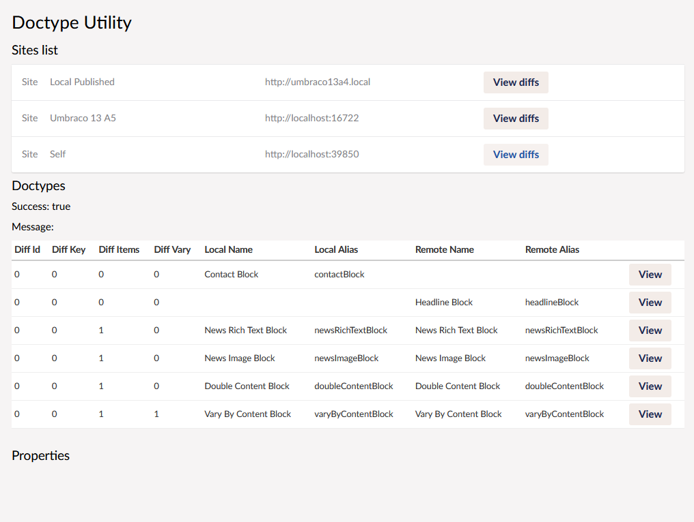
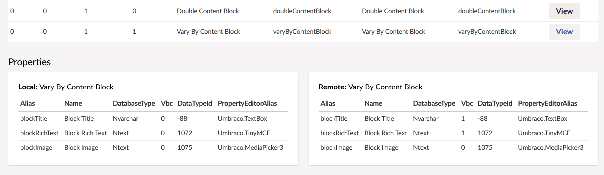
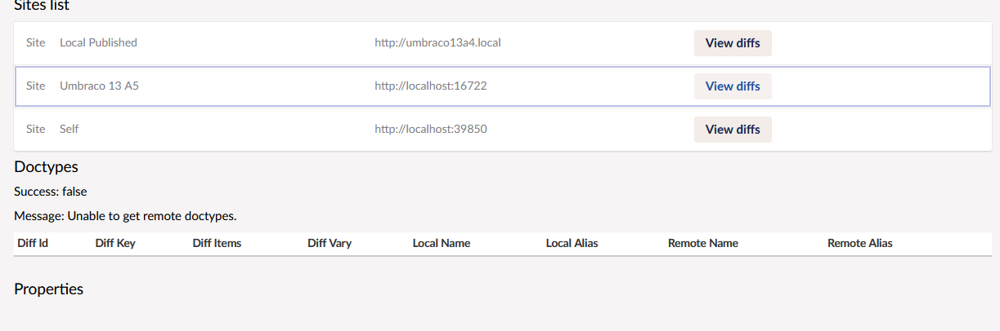

# Paravel.DoctypeUtility
1. A utility for comparing Doctypes on Different Umbraco sites.
2. This is written for Umbraco 13. 
3. Basically you install it on sites when you want to compare Doctypes to see if they are out of sync.
4. A dashboard will appear in the settings next to "Telemetry Data" or something like that.
5. You must add the sites in appsettings.json in the form stated below:

```
"DTUSettings": {
  "AuthToken": "6c1fddb5-003c-4059-bbe4-8be016e12e5f",
  "Sites": [
    {
      "Name": "Umbraco 13 A4",
      "Url": "http://umbraco13a4.local",
      "Key": "staging"
    },
    {
      "Name": "Umbraco 13 A5",
      "Url": "https://localhost:44317",
      "Key": "development"
    },
    {
      "Name": "Umbraco 13 A4 Debug",
      "Url": "https://localhost:44324",
      "Key": "local"
    }
  ]
}

```
6. The "Key" field is used in the angular to differenciate between the entries, so it has to be unique, although its only used locally, so does not have to match on the other sites appsettings.
7. The "AuthToken" field must be shared between the sites you want to compare. 

---

# This is the basic view


# this view is when you have clicked "View Diffs"



# this view is when you cant connect



